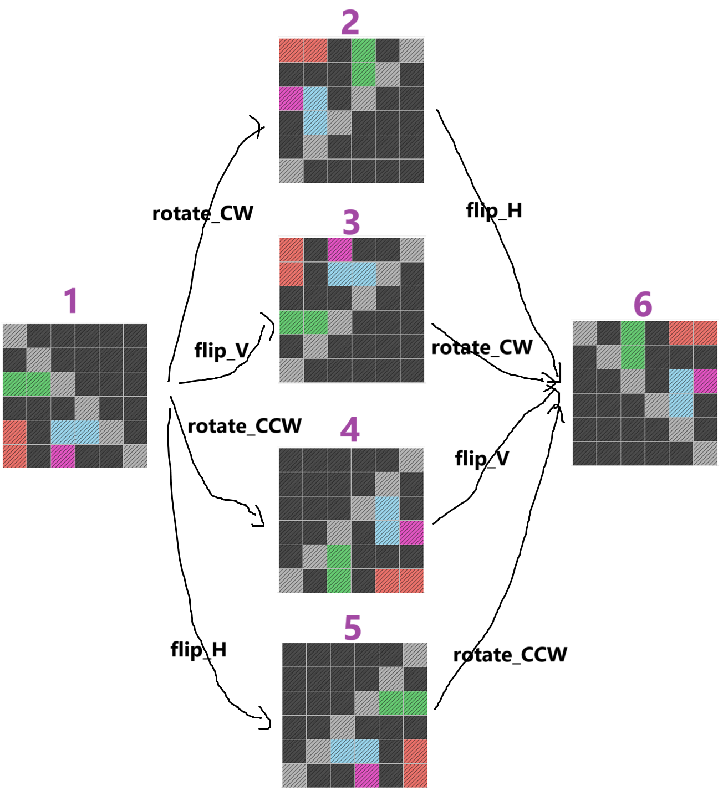

# Intention Learning with Decision Transformer

## Overview

This repository builds upon **Decision Transformer (NeurIPS 2021)** and extends prior work on ARC tasks using object-centric decision transformers.

In this study, we extract **popular states** from user trajectories and introduce **intention information** for each action to assess its impact on learning performance.

## Installation

This repository has been tested on **Ubuntu 22.04** with **Python 3.10**. To set up the environment, follow these steps:

1. Download and extract the repository.
2. Create and activate a new Conda environment.
3. Install dependencies from `requirements.txt`.

```sh
unzip IntentionLearning-DT.zip  
cd IntentionLearning-DT  
conda create -n intention python=3.10  
conda activate intention  
pip install -r requirements.txt
```

## Running the Code

### Data Preprocessing

We suggest intention as the **ideal edge** of the state space graph among **popular nodes**. Below image represents 6 popular states of the diagonal flip task. We add 2 states for `start` action and `end` action.

## Popular States for the Diagonal Flip Task

<p align="center">
    
</p>

Although the dataset in this repository already contains **annotated intention information**, you can preprocess the data manually.

```sh
./0_preprocess.sh TASK_NAME TRAIN_OR_TEST
```

- `TASK_NAME`: Currently, only **dflip** is supported, representing a **5x5 diagonal flip task**.
- `TRAIN_OR_TEST`: Specifies the dataset directory and can be one of the following: `train`, `test_1`, `test_2`, `test_3`, `test_4`.  

### Training

To train the model:

```sh
./1_train.sh TASK_NAME MODEL_NAME GPU_ID
```

- `TASK_NAME`: Currently, only **dflip** is supported. *(default value: 'dflip')*
- `MODEL_NAME`: Specifies the model variant to use. The available options are: *(default value: 'default')*
  - `default`: Standard **Decision Transformer (DT)** model.
  - `pnp`: DT model augmented with **object information** from the previous study.
  - `intention`: DT model augmented with **intention information**.
  - `pnp_intention`: DT model augmented with both **object and intention information**.
- `GPU_ID`: Specifies the GPU index to use during training. *(default value: 0)*

The training script runs for **400 epochs**, saving a checkpoint every **20 epochs**. Each time the model is saved, its performance is evaluated using **2,000 test samples from the `test_1` dataset**.

### Evaluation

To manually evaluate a trained model:

```sh
./2_test.sh TASK_NAME MODEL_NAME TEST_DATASET_NUM GPU_ID  
```

- `TASK_NAME`: The name of the task (currently supports **dflip**). *(default value: 'dflip')*
- `MODEL_NAME`: Specifies the trained model variant (`default`, `pnp`, `intention`, `pnp_intention`). *(default value: 'default')*
- `TEST_DATASET_NUM`: Specifies which **test dataset** to use for evaluation. *(default value: 0)*
  - If `1` to `4`: Runs evaluation on `test_1` to `test_4` using the current training checkpoint model (test with the checkpoint model from `./model/TASK_NAME/`).  
  - If `0`: Runs evaluation on **all test datasets (`test_1` to `test_4`)** using the fully trained model (test the final model from `./model/`).
- `GPU_ID`: Specifies the GPU index to use. *(default value: 1)*
